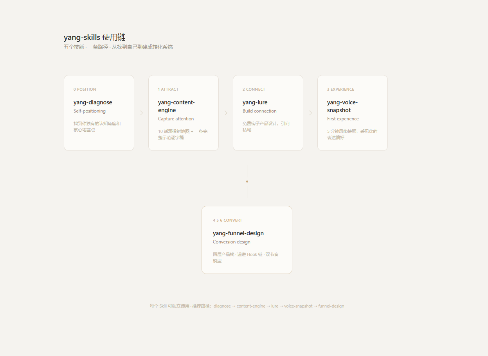

# yang-skills

> 我做了很多年大语言模型——研究的就是 AI 怎么理解人，怎么跟人匹配。后来我发现，这个问题的答案不在模型参数里，在人心里。所以我用算法思维和人性的洞察，融合出了一套关于转化的认知体系。现在我把它做成了五个 AI 原生技能——开源给你。
>
> 我不教你怎么像我。我帮你发现你是谁，然后把你散装的独特认知挖出来、立起来、变成内容、建成系统、持续变现。
>
> **愿景**：希望人人都能通过做自己就能舒服地赚到钱。
> **核心信念**：持续输出你独特的自己，才是变现的最优路径。

---

## 这是什么

**yang-skills** 是一套为「有东西但说不清、想变现但不想扭曲自己」的知识型创业者设计的 AI 原生技能集合。每个技能是一个 `SKILL.md` 文件，安装到你的 AI 助手后，它会通过三到五轮对话，引导你把经验、直觉和认知收束成可执行的策略文档——Markdown 格式，直接能用。

与传统内容的区别：文章读完就过了。视频看完就划走了。Skill 不一样——它**跟你对话**。你用一次，脑子里就多一个认知。

---

## 五个 Skill，一条转化链



每个 Skill 既是一条链上的一环，也可以独立使用。

### 0 — yang-diagnose · 自我定位

帮你从散装的经历、直觉判断和外部反馈中，提取出你自己都没意识到的独特认知模式。不是测评——是一面镜子。三轮对话，一份诊断报告，看清你的矿在哪、卡在哪。

### 1 — yang-content-engine · 捕获注意

把诊断结果翻译成可发的公域内容。不是替你写——给你一张10个话题的投射地图、一条完整的首发逐字稿作示范。看完示范，后面的你自己就会了。

### 2 — yang-lure · 建立连接

帮你设计一个让人愿意从「看看」变成「加你」的免费钩子产品——自查清单、小册子、诊断问卷。不是骗流量的饵，是「你拿到这个就知道我能帮你」的信任握手。

### 3 — yang-voice-snapshot · 首次体验

5 分钟、五组 AB 选择，即刻出结果。不测「你的表达好不好」，只让你第一次看见——你的表达在自己都没意识到的方向上，已经有它自己的形状了。

### 4 — yang-funnel-design · 逐级成交

把你散装的交付能力编排成四层产品栈——从免费认识到高价值长期服务。每一层做完，对方自然冒出一个新问题，下一层刚好接住。

---

## 安装

需要 Node.js 18+。运行 `node -v` 检查。

```bash
# 一键安装全部技能
npx skills add RayYeung1989/yang-skills

# 或安装单个技能
npx skills add RayYeung1989/yang-skills --skill yang-diagnose
```

也可手动安装：

```bash
git clone https://github.com/RayYeung1989/yang-skills.git
cp -r yang-skills/skills/yang-* ~/.claude/skills/
```

兼容 Claude Code、WorkBuddy、Cursor 等支持自定义技能的 AI 助手。

---

## 推荐使用路径

```
yang-diagnose → yang-content-engine → yang-lure → yang-voice-snapshot → yang-funnel-design
```

这是最强的链路——前面的 Skill 输出会被后面的 Skill 自动读取，认知层层叠加。但你也可以从任意入口独立启动——每个 Skill 都内置了轻量自诊，不卡人。

---

## 输出格式

所有 Skill 交付物为 Markdown 文件（`.md`），适用于 Obsidian / VSCode / Notion 等 Markdown 生态。

默认输出目录：`~/Documents/yang-notes/`  
文件命名：`{YYYYMMDDTHHMMSS}--{关键词}__{skill-tag}.md`

---

## 仓库结构

```
yang-skills/
├── README.md
├── CLAUDE.md              # AI 开发指南
├── CONTEXT.md             # 术语表与架构决策
├── assets/
│   ├── architecture.html   # 架构图源文件
│   └── architecture.png    # 架构图示
└── skills/
    ├── yang-diagnose/         # 0. 自我定位
    ├── yang-content-engine/   # 1. 捕获注意
    ├── yang-lure/             # 2. 建立连接
    ├── yang-voice-snapshot/   # 3. 首次体验
    └── yang-funnel-design/    # 4-6. 逐级成交
```

---

## 常见问题

**我需要先学什么吗？**

不需要。打开你的 AI 助手，输入 `/yang-diagnose`，跟着对话走就行。

**我不是创业者，能用吗？**

这套技能是为"想通过做自己来变现的知识工作者"设计的——自由职业者、顾问、教练、创作者、小团队负责人都在这个人群里。

**为什么是 Skill 而不是课程或文章？**

文章告诉你"应该怎么做"。Skill **陪你做**。它通过多轮对话把你的具体情况变成具体方案，不是套模板。

**免费吗？**

五个 Skill 全部开源免费。它们是种子——种到越多人手里，信任池越大。

---

## 许可

MIT License
